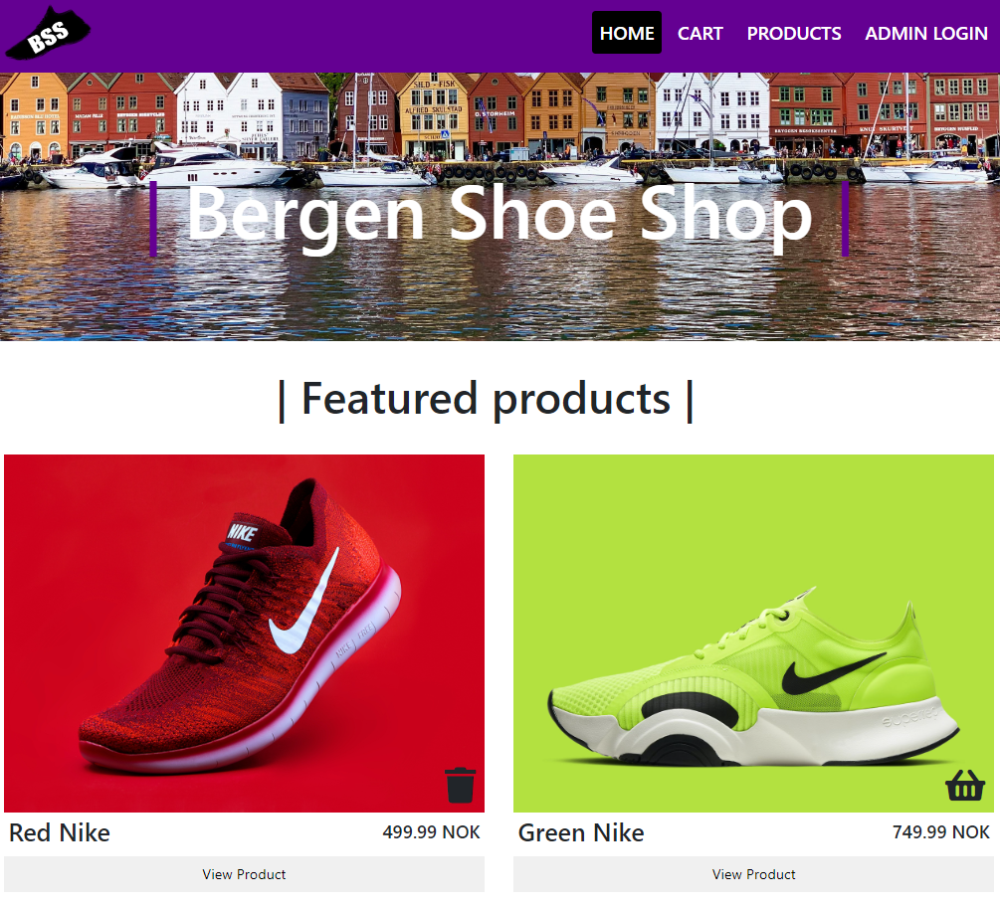

# Semester Project 2 / Bergen Shoe Shop



Bergen Shoe Shop is a ecommerce website for shopping shoes in Bergen, Norway.

## Description

Has featured products, page for all products with a search bar and a products specific page.

## Built With

- [JavaScript](https://www.javascript.com/)
- [Strapi](https://strapi.io/)
- [Heroku](https://www.heroku.com/)
- [Sass](https://sass-lang.com/)

## Getting Started

### Clone the repo

If you want to check out the project yourself, you can simply clone the repo using git.

1. Open a new terminal

```
Hold CTRL + SHIFT + ` to open a new terminal in vscode
```

2. Clone the repo:

```
git clone https://github.com/EpleWasTaken/erlend-svanevik-semester-project-2.git
```

3. Install the dependencies:

```
npm install
```

## Contact

[My Twitter](www.twitter.com/EpleWasTaken)

[My LinkedIn](https://www.linkedin.com/in/erlend-s-2206ab159/)

[My Website](https://www.epledev.com)

[My Discord](https://discord.com/users/195228341970796544)
